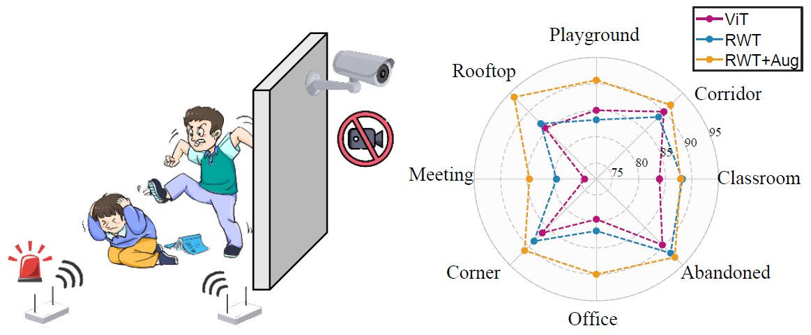

# WiFi-BullyDetect 👋

<p align="center">
  
</p>

**BullyDetect** is a novel method designed to detect physical bullying and violence in schools by leveraging Wi-Fi signals. This innovative approach aims to enhance safety and well-being in educational environments.

For more details on BullyDetect, refer to our paper: [**"BullyDetect: Detecting School Physical Bullying with Wi-Fi and Deep Wavelet Transformer"**](https://ieeexplore.ieee.org/document/10734315)

## Dataset 📊

The dataset used for BullyDetect is essential for training and evaluating the detection models. It includes both the original and preprocessed data.

- **Original Dataset**: [Download Link](https://www.kaggle.com/datasets/laptype/wifi-bullydetect)
- **Preprocessed Dataset**: [Download Link](https://www.kaggle.com/datasets/laptype/wifi-bullydetect)

Ensure you download and prepare the dataset as per the instructions provided to achieve optimal results with the BullyDetect system.

## Setup & Running 🛠️

Follow these steps to set up and run the BullyDetect system:

1. **Clone the Repository**:
   ```bash
   git clone https://github.com/aiotgroup/WiFi-BullyDetect.git
   cd WiFi-BullyDetect
   ```
2. Install Dependencies:
Ensure you have the required Python packages. Install them using:
   ```bash
   pip install -r requirements.txt
   ```
3. Change `basic_setting.json` to your own path

4. Run the training Script:

   ```bash
   python script/basic_train.py
   ```
   
## Contacts Us ✉️
For any queries, you are welcome to open an issue.

## License 📜
BullyDetect is licensed under the MIT License. See the LICENSE file for more details.

## Citations 📄

If you find our works useful in your research, please consider citing:
```BibTeX
@ARTICLE{lan2024bullydetect,
  author={Lan, Bo and Wang, Fei and Xia, Lekun and Nai, Fan and Nie, Shiqiang and Ding, Han and Han, Jinsong},
  journal={IEEE Internet of Things Journal}, 
  title={BullyDetect: Detecting School Physical Bullying With Wi-Fi and Deep Wavelet Transformer}, 
  year={2024},
  keywords={Wireless fidelity;Transformers;Noise;Videos;Data augmentation;Cameras;Sensors;Representation learning;Internet of Things;Surveillance;Wi-Fi sensing;physical bullying detection;wavelet transformer;data augmentation;deep learning},
  doi={10.1109/JIOT.2024.3486071}
}
```
